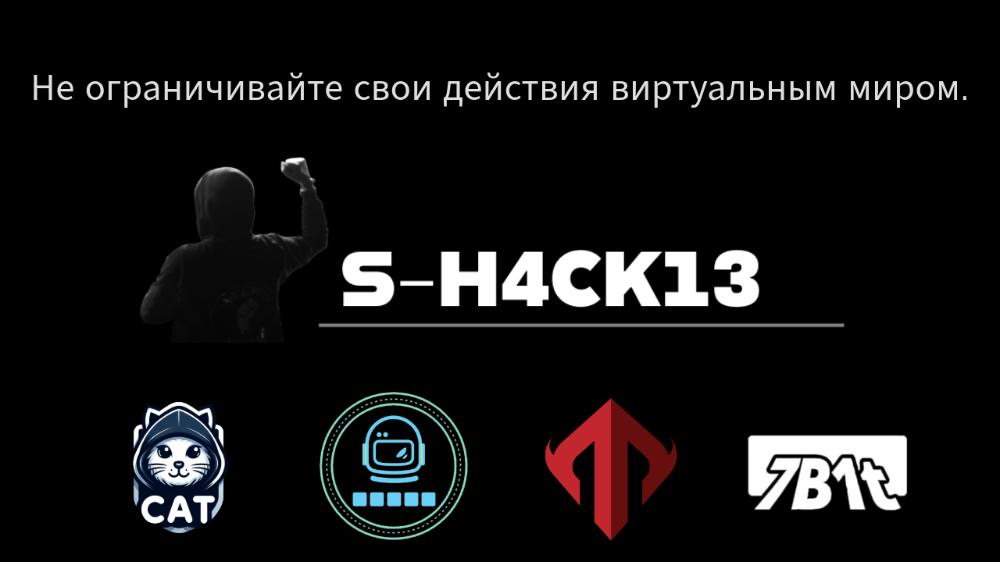

 
 
# >>>Кто я?<<<

 
  
 

# S-H4CK13 @ Мартин.

<h1>YouTube:https://www.youtube.com/@Martin3x_x3</h1>

==================================================================

S-Clustr This tool exists in two versions simultaneously:

Ring Network Upgrade Version (high anonymity, full functionality, recommended): https://github.com/MartinxMax/S-Clustr/releases/tag/S-Clustr-V3.0

Basic TCP Previous Version (unsafe, not recommended, stable): https://github.com/MartinxMax/S-Clustr-Ring/releases/tag/S-Clustr_Ring

==================================================================

- [💉 MSQP](https://github.com/MartinxMax/MSQP):This is a MySQL privilege escalation tool.
- [🩺 Nessus-M](https://github.com/MartinxMax/Nessus-M):A brute-force tool for Nessus vulnerability scanner login interface.
- [🎃 Inferno](https://github.com/MartinxMax/Inferno):EtherNet/IP OT Network hacker tool.
- [🔎 Image To Ascii](https://github.com/MartinxMax/ImageToAscii):Convert website images to Ascii for online.
- [🎭 H4vdo (H4vdo)](https://github.com/MartinxMax/H4vdo): RTMP lock screen playback video tool, you can send payload to the target, the target's screen plays content. The target cannot operate the computer.
- [🤿 Vunlhub-wp (Vulnhub walkthough)](https://github.com/MartinxMax/vulnhub-wp): vulnhub walkthough tool
- [🧿 NAPLISTENER (APT-REF2924-Backdoor)](https://github.com/MartinxMax/NAPLISTENER): APT-REF2924 backdoor scanner.
- [🥽 CheatFetcher (game cheat high-speed download)](https://github.com/MartinxMax/CheatFetcher): Flingtrainer.
- [🌙 M0on v1.2 (MCGS)](https://github.com/MartinxMax/Mo0n_V1.2): The MCGS industrial networks touchscreen zero-day vulnerabilities.
- [💀 S-Clustr-Ring-Network (annular botnets)](https://github.com/MartinxMax/S-Clustr-Ring): A botnet controlled by the Ring Network, containing IOT, IT, OT control industry.
- [🚪 Simple_Door (51 microcontroller entrance guard)](https://github.com/MartinxMax/Simple_Door): An entrance guard utilizing 51 single-chip microcontrollers, and broken with the Arduino 
- [💀 S-Clustr (Zombie Network)](https://github.com/MartinxMax/S-Clustr): A botnet, with CS control of TCP.
- [🗣️ MChat-Gpt (Chatgpt)](https://github.com/MartinxMax/MChat-Gpt): Chatgpt connected to the LAN to provide query service for all users in the Intranet.
- [📞 Caller (sending voice)](https://github.com/MartinxMax/Caclert): A malware generator that can reverse connect to attackers, allowing them to send voice messages.
- [🐜 Anteater (directory sensitive information)](https://github.com/MartinxMax/Anteater): Accesses specified directories for sensitive information, useful in penetration testing to obtain 
- [📷 Nets3e (pictures)](https://github.com/MartinxMax/Nets3e): Sends pictures from the client to the attacker, who can selectively display them.
- [🌙 Night_of_19 bluetooth control (Bash)](https://github.com/MartinxMax/Night_of_19): Utilizes reverse shell rebounded to Bluetooth for control.
- [📚 MAPI (API library)](https://github.com/MartinxMax/MAPI): A comprehensive library for advanced API manipulation.
- [🔍 MartSQLI SQL injection (Automatic)](https://github.com/MartinxMax/MartSQLI): Rapid extraction of target server configuration information through SQL injection.
- [⚙️ MCGS_DD (NT kernel MCGS touch screen)](https://github.com/MartinxMax/MCGS_DD): Zero-day vulnerabilities, allowing DDOS attacks on NT kernel MCGS touch screens.
- [📂 MSSRF (SSRF attack recognition)](https://github.com/MartinxMax/MSSRF): Detection of SSRF loopholes on target servers and exploitation.
- [📤 GitPush (making a Push)](https://github.com/MartinxMax/GitPush): A simple UI tool for pushing code to GitHub repositories.
- [💥 MCollider (Digital Blasting MD5)](https://github.com/MartinxMax/MCollider): Blasting MD5 values, supporting fuzzy matching.
- [📦 MBAK (Backup file explosion)](https://github.com/MartinxMax/MBAK): Targeting backup files for explosion.
- [🔵 MRaider (Bluetooth near-source penetration attack)](https://github.com/MartinxMax/MRaider): Uses C51 combined with Bluetooth for HID attacks.
- [🔐 MSSTI (Verification SSTI vulnerability)](https://github.com/MartinxMax/MSSTI): Tests and exploits Server-Side Template Injection (SSTI) vulnerabilities.
- [🔥 MAntagonist (PHP pseudo protocol file read explosion)](https://github.com/MartinxMax/MAntagonist): Bypasses PHP file reading restrictions using encoded protocols.
- [🐶 MDOG_GGB (XSS tool UI)](https://github.com/MartinxMax/MDOG): UI version of XSS exploitation tool, supporting real-time deployment and page redirects.
- [🐶 MDOG_GGB (XSS tool)](https://github.com/MartinxMax/MDOG_GGB): XSS exploitation tool.
- [🔏 MPHP (Verification ThinkPHP vulnerability)](https://github.com/MartinxMax/MPHP): Validates and exploits ThinkPHP vulnerabilities.
- [💣 MBlast (Sensitive character filtering detection analysis)](https://github.com/MartinxMax/MBlast): Sends special characters to verify server filtering.
- [🕹️ Regulator (Leave the automatic screen)](https://github.com/MartinxMax/Regulator): Automatically locks the screen when the administrator leaves the station.
- [🔒 Mole (Web hijacking using LD_PRLAOD function hijacking)](https://github.com/MartinxMax/Mole): Utilizes LD_PRLOAD for function hijacking and command execution.
- [🔓 MXXE (XXE vulnerability data receiver)](https://github.com/MartinxMax/MXXE): Exploits XXE vulnerabilities to access sensitive data.
- [⏳ Mpol (C4 bomb made by AT89C51)](https://github.com/MartinxMax/Mpol): Detonates AT89C51-based C4 bombs remotely.
- [🎮 MTO (STM32 Remote control stepper motor)](https://github.com/MartinxMax/MTO): Controls STM32 stepper motors via web server and traffic transfer.
- [🌐 MDPG (DHCP Starvation Attacks)](https://github.com/MartinxMax/MDPG): Performs DHCP flooding attacks.
- [📋 MDPG_U (Automated DHCP flooding attacks V2.4 / GUI)](https://github.com/MartinxMax/MDPG_U): Automated DHCP flooding attacks with a user-friendly interface.
- [🕸️ Web-crawlers-get-web-links (Crawl all links under the specified webpage)](https://github.com/MartinxMax/Web-crawlers-get-web-links): Extracts all links from specified web pages.
- [📸 Martin_Video_Hacker-V1.0 (Hot key trigger to capture Pictures)](https://github.com/MartinxMax/Martin_Video_Hacker-V1.0): Captures images using hotkeys.

 

