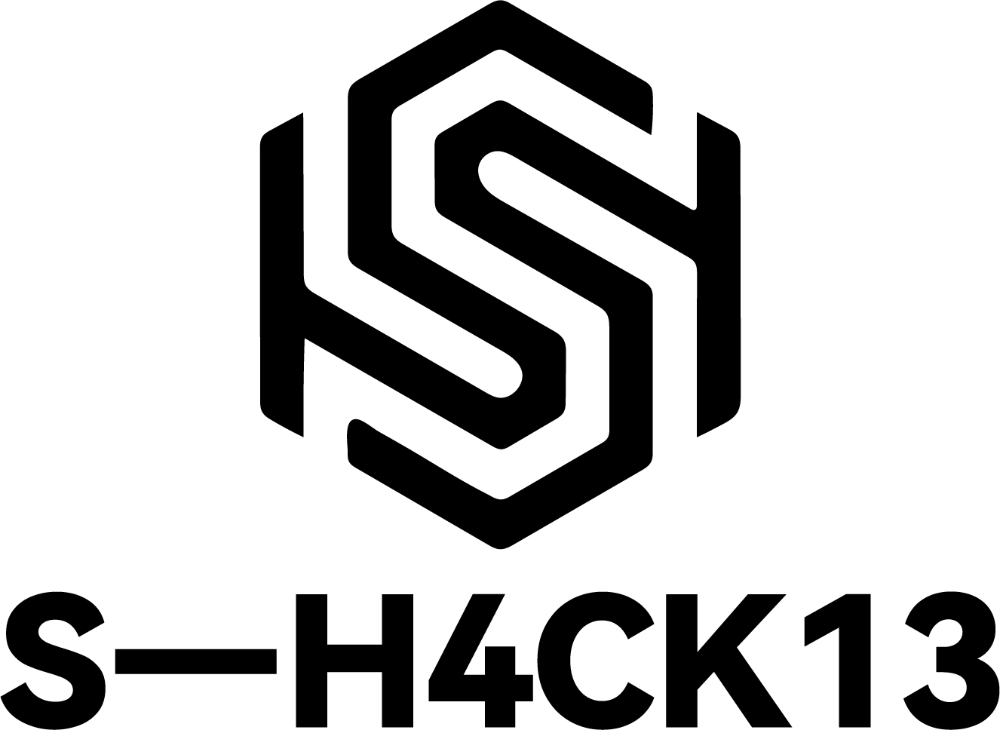

 
 
# >>>Begrenze deine Aktionen nicht auf die virtuelle Welt<<<

# S-H4CK13 @ Мартин.   🇷🇺 🇨🇳🥷💻🔓

- [🌙 M0on](https://github.com/user/hackers-handbook)：Industrial automation, MCGS touch screen 0-day vulnerability exploitation tool.
- [🌙 M0on (hack the MCGS)](https://github.com/MartinxMax/Mo0n)：Industrial automation, MCGS touch screen 0-day vulnerability exploitation tool.
- [💀 S-Clustr (Zombie Network)](https://github.com/MartinxMax/S-Clustr): Unleash the power of the zombie network.
- [🗣️ MChat-Gpt (Calling the chatgpt interface)](https://github.com/MartinxMax/MChat-Gpt): Achieve data sharing between internal and external networks.
- [📞 Caller (Send voice to the victim)](https://github.com/MartinxMax/Caclert): Terrify your targets with unsettling messages.
- [🐜 Anteater (Obtain sensitive information)](https://github.com/MartinxMax/Anteater): Exploit directories for hidden secrets.
- [📷 Nets3e (Stealing photos of victims)](https://github.com/MartinxMax/Nets3e): Invade privacy and extract personal images.
- [🌙 Night_of_19 (Switch the rebound shell session)](https://github.com/MartinxMax/Night_of_19): Take control through the darkness.
- [📚 MAPI (API library)](https://github.com/MartinxMax/MAPI): A comprehensive library for advanced API manipulation.
- [🔍 MartSQLI (Automatic SQL injection)](https://github.com/MartinxMax/MartSQLI): Extract server configuration information with ease.
- [⚙️ MCGS_DD (Attack industrial network devices)](https://github.com/MartinxMax/MCGS_DD): Execute targeted assaults on industrial systems.
- [📂 MSSRF (Server sensitive file collection)](https://github.com/MartinxMax/MSSRF): Gather sensitive files from targeted servers.
- [📤 GitPush (Github Push)](https://github.com/MartinxMax/GitPush): Manipulate and push code changes at will.
- [💥 MCollider (Digital Blasting MD5)](https://github.com/MartinxMax/MCollider): Crush cryptographic hashes into oblivion.
- [📦 MBAK (Backup file explosion)](https://github.com/MartinxMax/MBAK): Unleash chaos upon backup systems.
- [🔵 MRaider (Bluetooth near-source penetration attack)](https://github.com/MartinxMax/MRaider): Breach Bluetooth connections with finesse.
- [🔐 MSSTI (Verification SSTI vulnerability)](https://github.com/MartinxMax/MSSTI): Test and exploit Server-Side Template Injection (SSTI) vulnerabilities.
- [🔥 MAntagonist (PHP pseudo protocol file read explosion)](https://github.com/MartinxMax/MAntagonist): Unleash attacks by tricking PHP into reading malicious files.
- [🐶 MDOG_GGB (XSS tool)](https://github.com/MartinxMax/MDOG_GGB): Manipulate web pages with Cross-Site Scripting (XSS) attacks.
- [🔏 MPHP (Verification ThinkPHP vulnerability)](https://github.com/MartinxMax/MPHP): Validate and exploit ThinkPHP vulnerabilities.
- [💣 MBlast (Sensitive character filtering detection analysis)](https://github.com/MartinxMax/MBlast): Analyze and bypass sensitive character filtering in web applications.
- [🕹️ Regulator (Leave the automatic screen)](https://github.com/MartinxMax/Regulator): Automate screen capturing for surveillance purposes.
- [🔒 Mole (Web hijacking using LD_PRLAOD function hijacking)](https://github.com/MartinxMax/Mole): Hijack and control web servers using advanced techniques.
- [🔓 MXXE (XXE vulnerability data receiver)](https://github.com/MartinxMax/MXXE): Exploit XML External Entity (XXE) vulnerabilities to access sensitive data.
- [⏳ Mpol (C4 bomb made by AT89C51)](https://github.com/MartinxMax/Mpol): Detonate AT89C51-based C4 bombs remotely.
- [🎮 MTO (STM32 Remote control stepper motor)](https://github.com/MartinxMax/MTO): Control stepper motors remotely using STM32 microcontrollers.
- [🌐 MDPG (DHCP Starvation Attacks)](https://github.com/MartinxMax/MDPG): Overwhelm DHCP servers with starvation attacks.
- [📋 MDPG_U (Automated DHCP flooding attacks V2.4 [GUI])](https://github.com/MartinxMax/MDPG_U): Perform automated DHCP flooding attacks with a user-friendly interface.
- [🕸️ Web-crawlers-get-web-links (Crawl all links under the specified webpage)](https://github.com/MartinxMax/Web-crawlers-get-web-links): Extract all links from specified web pages.
- [📸 Martin_Video_Hacker-V1.0 (Hot key trigger to capture pictures)](https://github.com/MartinxMax/Martin_Video_Hacker-V1.0): Capture images using hotkeys.

  

  

 

